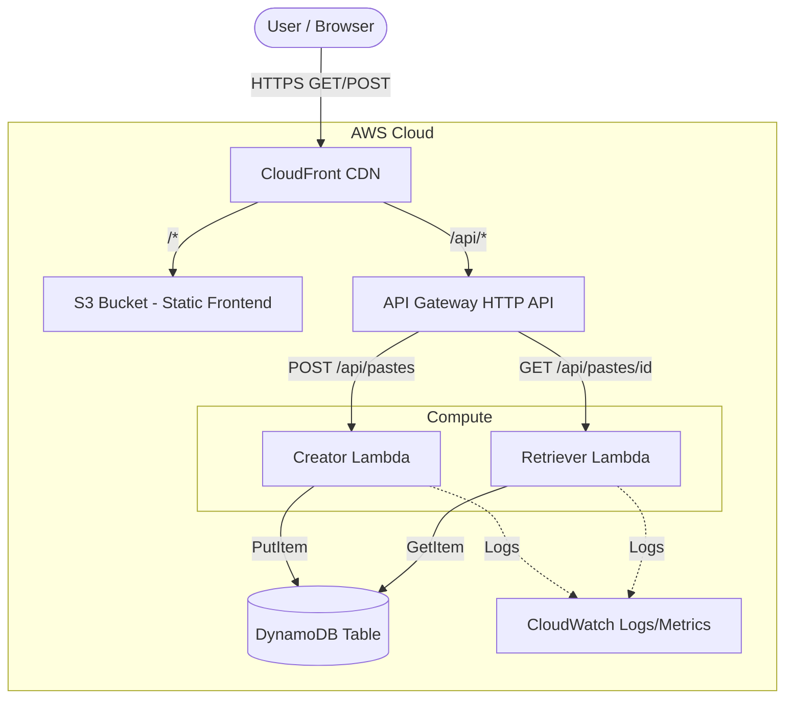

# Architecture

```mermaid
graph TD
    User([User / Browser])
    
    subgraph AWS Cloud
        CF[CloudFront CDN]
        S3[S3 Bucket - Static Frontend]
        API[API Gateway HTTP API]
        
        subgraph Compute
            L1[Creator Lambda]
            L2[Retriever Lambda]
        end
        
        DB[(DynamoDB Table)]
        
        CW[CloudWatch Logs/Metrics]
    end
    
    User -->|HTTPS GET/POST| CF
    CF -->|/*| S3
    CF -->|/api/*| API
    
    API -->|POST /api/pastes| L1
    API -->|GET /api/pastes/id| L2
    
    L1 -->|PutItem| DB
    L2 -->|GetItem| DB
    
    L1 -.->|Logs| CW
    L2 -.->|Logs| CW
```
